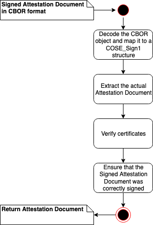

# 认证(Attestation)

Attestation 就是要验证应用所在的 software 和 hardware stack 是否是安全和可信的。

## 虚拟机的认证

我们在部署一个应用的时候面临的一个问题是，如何保证虚拟机的操作系统是我指定的操作系统？中间有人篡改过我的操作系统镜像文件吗？启动过程中用到的 init raw disk 被人篡改过吗？我的根文件系统被人篡改过吗？这个问题其实就是应用所在的 software stack 是否安全、可信。在可信计算中，我们通常称这个过程为虚拟机的认证（attestation）。

解决这个问题，通常的做法是基于 init raw disk， OS image， root disk 生成一系列的哈希文件，当系统启动以后，再次生成哈希文件，当系统启动以后的文件和之前生成的文件一致的时候，我们就认为认证通过了。

## 容器镜像的认证

不同于虚拟机的认证，容器镜像的认证要相对容易些，通常的做法是对容器镜像进行签名或者加密，然后把签名过或加密过的镜像push到镜像服务器上，当部署应用需要拉取容器镜像的时候，容器镜像的运行时要验证镜像签名或者解压加密过的镜像文件。

业界常用的容器镜像签名有两种：
- Docker Content Trust (DCT)

文档 [DCT](https://docs.docker.com/engine/security/trust/) 详细介绍了DCT的工作机制

更详细的镜像签名的介绍也可以参考[How To Sign](https://searchitoperations.techtarget.com/definition/Docker-Content-Trust)，架构如下图：


- RedHat Image Siging

文档 [RedHat Image Siging](https://access.redhat.com/documentation/en-us/red_hat_enterprise_linux_atomic_host/7/html/managing_containers/signing_container_images) 详细介绍了RedHat Image Sigining的工作机制


但是不管是DCT还是Redhat Image Sigining， 都需要两个前提条件：
1. 就是拉取容器镜像的环境是安全的，是一个 Trusted Execution Environment (TEE)。
2. 虚拟机得到了认证，保存的用于验证容器签名的密钥是没有被篡改过的。

所以这是一个信任的链条，当虚拟机的认证没办法保证的时候，容器的认证也就无从谈起了。

## 如何验证虚拟机镜像

### AWS Nitro

我们以 AWS Nitro 作为例子来介绍一下虚拟机是如何验证OS Image的, 下面是 AWS Nitro的工作原理摘抄，也比较简单，就不做翻译了。

- 1. Attestation in the Nitro Enclaves World

>The purpose of attestation is to prove that an enclave is a trustworthy entity, based on the code and configuration that is running within a particular enclave. The root of trust for the enclave resides within the AWS Nitro system, which provides Attestation Documents to the enclave, signed by the AWS Nitro Attestation Public Key Infrastructure (PKI).

>The root of trust component for the attestation is the Nitro hypervisor, that contains information about the enclave, including platform configuration registers (PCR) and produces an attestation document that contains details of the enclave: enclave signing key, hash of the enclave image, the instance it is attached to, the role attached to the instance and more.

> Attestation documents are signed by the AWS Nitro Public Key Infrastructure (PKI), which includes a published certificate authority that can be incorporated into any service.

- 2. Attestation Document
> The enclave is able to request from the Nitro hypervisor an attestation document that allows an external service to verify caller’s identity. The attestation document generated by the Nitro system follows this specific format, encoded in Concise Binary Object Representation (CBOR) and signed using CBOR Object Signing and Encryption (COSE).

> Attestation documents are signed by the AWS Nitro Attestation PKI, which includes a root certificate for the commercial AWS partitions that can be found here (SHA256 8cf60e2b2efca96c6a9e71e851d00c1b6991cc09eadbe64a6a1d1b1eb9faff7c).

> The root certificate is based on an ACM PCA private key and has a lifetime of 30 years. The subject of the CA should follow this format:

> CN=<partition>.nitro-enclaves, C=US, O=Amazon, OU=AWS

- 3. AWS Nitro validation Flow



更详细的细节大家可以参考 [aws-nitro-enclaves](https://github.com/aws/aws-nitro-enclaves-nsm-api/blob/main/docs/attestation_process.md)

### IBM LinuxONE Secure Execution

另外一个比较流行的平台是 IBM LinuxONE Secure Execution， 这里就不详细介绍了，大家可以参考 [LinuxONE](https://www.ibm.com/docs/en/linux-on-systems?topic=tasks-secure-guest)。

## 如何验证容器镜像

前面提到了，容器镜像的安全是以虚拟机的安全为前提的，Kata就是一个这样的容器运行时环境。

### Kata Attestation Agent

[Kata CCv0 Design](https://docs.google.com/presentation/d/1SIqLogbauLf6lG53cIBPMOFadRT23aXuTGC8q-Ernfw/edit#slide=id.ge592e42b80_0_0) 介绍了如何在Kata实现容器的Attestation。架构如下图：


## 下面列出一个在IBM Cloud上给容器镜像签名的具体操作：

- 1. 创建 GPG Keys

Create private GPG key with the `gpg2 --gen-key` command. Add a **passphrase** when prompted.

Create a public key from the private key:
```bash
gpg2 --armor --export --output <public_key_name>.gpg <private_key_name>
```

The `<private_key_name>` is the email address input when creating private key.

Please also replace `<public_key_name>`. The command will generate a public key file with name `<public_key_name>.gpg`.

- 2. 在 IBM Cloud Container Registry 创建 namesapce

Install Cloud CLI on Linux:
```
curl -fsSL https://clis.cloud.ibm.com/install/linux | sh
```

Install IBM Cloud Container Registry CLI plug-in
```
ibmcloud plugin install container-registry
```

Login IBM Cloud and create a namespace. Replace `<my_namespace>` with your preferred namespace:
```
ibmcloud cr namespace-add <my_namespace>
```

- 3. 拉取一个镜像

Pull image with podman:
```
podman pull docker.io/library/nginx:stable
```

Tag the image. Replace `<region>` with the name of your region(`ibmcloud cr region`), Replace `<my_namespace>` with the namespace you just created in Step 2.
```
podman tag docker.io/library/nginx:stable <region>.icr.io/<my_namespace>/nginx:stable
```

- 4. 给镜像签名并上传

The `apikey` is created with `ibmcloud iam` commands.
```
sudo -E GNUPGHOME=$HOME/.gnupg \
    podman push \
    --tls-verify=false \
    --sign-by <private_key_name> \
    --creds iamapikey:<apikey> \
    <region>.icr.io/<my_namespace>/nginx:stable
```

You need provide the **passphrase** input in Step 1.

- 5. 配置 Podman 以验证镜像签名

You can configure it via `podman image trust` command. For example:
```
podman image trust set --pubkeysfile <path>/<public_key_name>.gpg <region>.icr.io/<my_namespace>
```

Use the absolute path of the public key file created in Step 1. Replace `<region>` with the name of your region(`ibmcloud cr region`), Replace `<my_namespace>` with the namespace you just created in Step 2.

Check the configuration file `/etc/containers/policy.json`:
```json
{
    "default": [
        {
            "type": "insecureAcceptAnything"
        }
    ],
    "transports": {
        "docker": {
            "us.icr.io/hg2demo": [
                {
                    "type": "signedBy",
                    "keyType": "GPGKeys",
                    "keyPath": "bundle/mysignkey.gpg"
                }
            ]
        }
    }
}
```

Note: The default type `insecureAcceptAnything` can be set as `reject` via command:
```
sudo podman image trust set -t reject default
```

Now pull the image with podman:
```
podman pull \
    --creds iamapikey:<apikey> \
    <region>.icr.io/<my_namespace>/nginx:stable
```

If there is no public key file on the key path configured in `/etc/containers/policy.json`, you'll get following error:
```
Trying to pull us.icr.io/hg2demo/nginx:stable...
Error: Source image rejected: open bundle/mysignkey.gpg: no such file or directory
```

Note: Pull image with another tag will also fail.
```
podman pull \
    --creds iamapikey:<apikey> \
    <region>.icr.io/<my_namespace>/nginx:another
```

- 6. 配置 podman 拉取镜像的认证信息

You can try command `podman login` to login your registry with credential, and it will create an authentication file in the default path `${XDG_RUNTIME_DIR}/containers/auth.json`.

You can also edit the auth.json file manually to configure registry credential:
```
{
	"auths": {
		"us.icr.io": {
			"auth": "<base64 encoded string of `iamapikey:<apikey>`>"
		}
	}
}
```

- 7. 拉取镜像并验证签名
```
podman pull <region>.icr.io/<my_namespace>/nginx:stable
```
