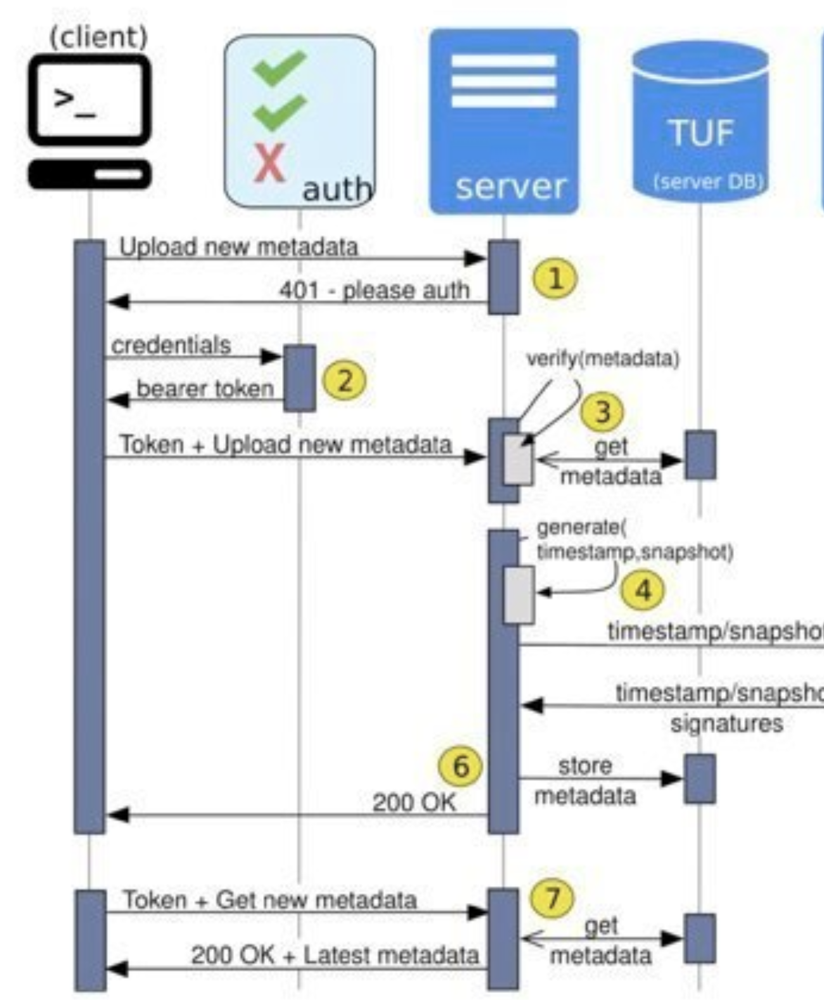
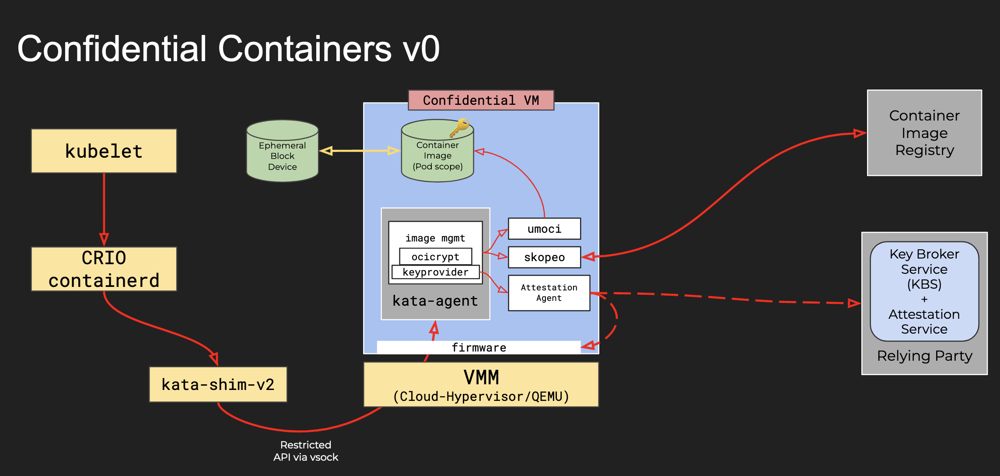

# 认证(Attestation)

Attestation 就是要验证应用所在的software和hatdware stack是安全和可信的。

## 虚拟机的认证

我们在部署一个应用的时候面临的一个问题是，如何保证虚拟机的操作系统是我指定的操作系统？中间有人篡改过我的操作系统镜像文件吗？启动过程中用到的 init raw disk 被人篡改过吗？我的根文件系统被人篡改过吗？这个问题其实就是应用所在的software stack是否安全，可信。在可信计算中，我们通常这个过程为虚拟机的认证（attestation）。

解决这个问题，通常的做法是基于 init raw disk， OS image， root disk 生成一系列的哈希文档，当系统启动以后，再此生成哈希文档，当系统启动以后的文档和之前生成的文档一致的时候，我们就认为认证通过了。

## 容器镜像的认证

不同于虚拟机的认证，容器镜像的认证要相对容易些，通常的做法是对容器镜像进行签名或者加密，然后把签名过或加密过的镜像push到镜像服务器上，当部署应用需要拉取容器镜像的时候，容器镜像的运行时要验证镜像签名或者解压加密过的镜像文件。

业界常用的容器镜像签名有两种：
- Docker Content Trust (DCT)

文档 [DCT](https://docs.docker.com/engine/security/trust/) 详细介绍了DCT的工作机制

跟详细的镜像签名的介绍也可以参考[How To Sign](https://searchitoperations.techtarget.com/definition/Docker-Content-Trust)，架构如下图：

- RedHat Image Siging

文档 [RedHat Image Siging](https://access.redhat.com/documentation/en-us/red_hat_enterprise_linux_atomic_host/7/html/managing_containers/signing_container_images) 详细介绍了RedHat Image Sigining的工作机制

但是不管是DCT还是Redhat Image Sigining， 这需要两个前提条件：
1. 就是拉取容器镜像的环境是安全的，是一个 Trusted Execution Environment (TEE)。
2. 虚拟机得到了验证，保存的用于验证容器签名的密钥是没有被篡改过的。

所以这是一个信任的链条，当虚拟机的认证没办法保证的时候，容器的认证也就无从谈起了。

## 如何验证虚拟机镜像

### AWS Nitro

[aws-nitro-enclaves](https://github.com/aws/aws-nitro-enclaves-nsm-api/blob/main/docs/attestation_process.md) 介绍了 Nitro的一些细节

### IBM LinuxONE Secure Execution

[LinuxONE](https://www.ibm.com/docs/en/linux-on-systems?topic=tasks-secure-guest) 介绍了 IBM Secure Execution的一些细节

## 如何验证容器镜像

前面提到了，容器镜像的安全是以虚拟机的安全为前提的，Kata就是一个这样的容器运行时环境。

### Kata Attestation Agent

[Kata CCv0 Design](https://docs.google.com/presentation/d/1SIqLogbauLf6lG53cIBPMOFadRT23aXuTGC8q-Ernfw/edit#slide=id.ge592e42b80_0_0) 介绍了如何在Kata实现容器的Attestation。架构如下图：

